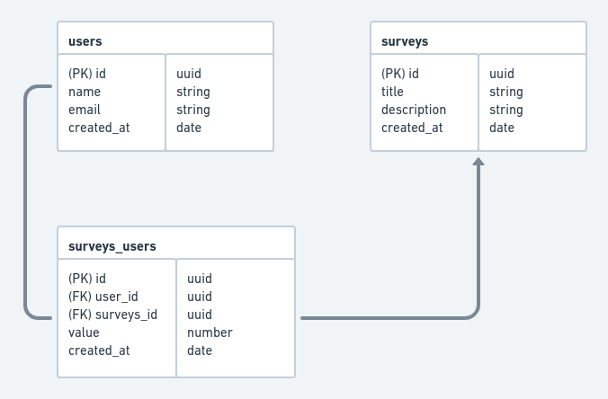

# NLW#4 - NodeJS

## Projeto

Nesta edição da trilha Node foi abordado como criar uma aplicação totalmente do zero com NodeJs e TypeScript, com acesso a banco de dados, envio de emails e testes.

No primeiro dia vamos aprender os conceitos básicos sobre o que é uma API, entender o que é o NodeJS, onde ele tem sido utilizado e qual problema ele veio solucionar e também. Vamos também conhecer o Typescript e entender como ele irá nos ajudar durante o desenvolvimento da nossa aplicação. Já nessa aula vamos dar início ao desenvolvimento da nossa API, colocando em prática alguns dos conceitos aprendidos.

* [ ] Dia 1 - Fundamentos do NodeJS
  * [ ] Por que usar Typescript?
  * [ ] Criar projeto com NodeJS
    * [ ] Criar primeira rota
    * [ ] conhecer tipos de métodos
    * [ ] Criar rota POST
    * [ ] Configurar Insominia

Banco de Dados
No segundo dia vamos iniciar a configuração do banco de dados na nossa aplicação, aprendendo algumas formas possíveis para realizar o acesso do banco de dados através do Nodejs. Vamos entender os conceitos de migrations, models e criar nossa primeira tabela de usuário. Também nessa aula iremos aprender e criar nosso primeiro Controller, isolando toda regra para dentro dele.

* [ ] Dia 2 - Banco de dadas
    * [ ] Conhecendo as formas de trabalhar com banco de dados na aplicação
    * [ ] Configuração do TypeORM na aplicação
    * [ ] Criar migration de usuário
    * [ ] Criar controller do usuário
    * [ ] criar rota do usuário
  
Testando a nossa aplicação
No terceiro dia vamos conhecer o conceito de Repository e como podemos utilizar ele para separar as responsabilidades nos componentes corretos. Vamos também dar inícios aos testes automatizados e entender os benefícios que eles trazem para a nossa aplicação.

* [ ] Dia 3 - Repositórios, testes automatizados
  * [ ] Refatorar nosso controller
    * [ ] Criar um repository de usuário
    * [ ] Alterar no controller para o repository criado
  * [ ] Criar migration de pesquisa (survey)
  * [ ] Criar repositorio de pesquisa
  * [ ] Criar controller de pesquisa
  * [ ] O que são testes automatizados?
  * [ ] Criar primeiro teste

Envio de e-mail
No quarto dia vamos aprender como enviar e-mail, utilizando templates customizados com informações vindas do banco de dados. Vamos aprender também como utilizar variáveis de ambiente dentro da aplicação
 
* [ ] Dia 4 - Envio de e-mail
  * [ ] criar migration de surveysUsers
  * [ ] criar model
  * [ ] criar repositório
  * [ ] criar controller
  * [ ] criar serviço de email
  * [ ] enviar email

Finalizando nossa api com validações
Nessa última aula vamos finalizar o fluxo da nossa aplicação, inserir validações dos dados recebidos e aprender como tratar os possíveis erros.

* [ ] Dia 5 - Finalizando nossa api com validações
  * [ ] Refatorar o SendmailController
  * [ ] Criar controller de resposta de usuário
    * [ ] Validar se o usuário existe
    * [ ] Alterar a nota da resposta
  * [ ] Criar controller com cálculo no NPS
  * [ ] Criar validações
 
 #rumoaoproximonivel #jornadainfinita #focopraticagrupo #neverstoplearning #missioncomplete

 Diagram
 

 

## Techs
* [ ] NodeJS
* [ ] TypeORM
* [ ] TypeScript
* [ ] SqLite
* [ ] Nodemailer

## Getstarted
### Dependencias

- Express : mini-framework que controla rotas
- typescript: 
- ts-node-dev : convert codigo para js
- typeorm
- sqlite
- uuid
- jest
- supertest
- nodemailer: envio de email com o ethereal
- handlebars: templete pra os emails
- yup: validações
- express-async-errors

### Configurações
tsconfig.json
- "strict": false,

scripts pakage.json : 
--transpile-only ignora checagem de erros de tipagem, pois o proprio VScode faz 
--ignore-watch node_modules : ignora tudo que acontece no node_modules
